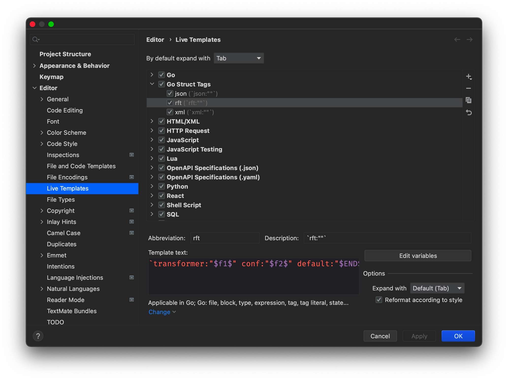
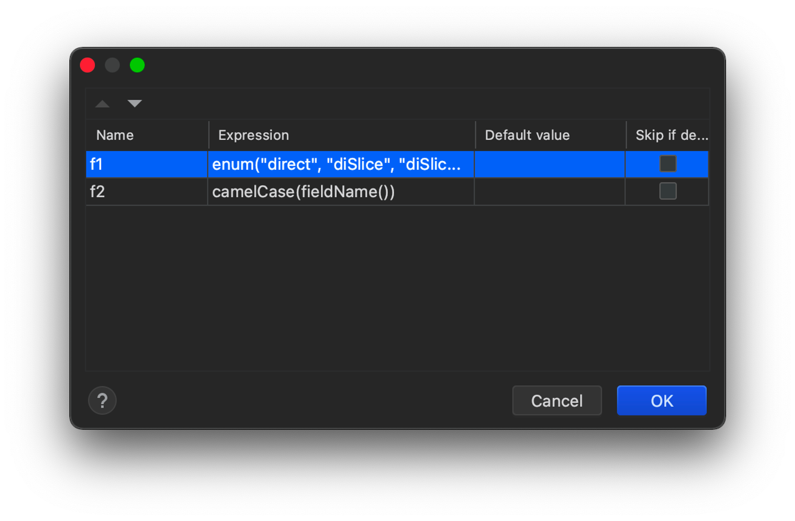

# 一、reflectConf

`reflectConf` 是一个基于 Go 语言中 `reflect` 技术的通用配置解析工具。

`reflectConf` 可以按照在 `struct tag` 中配置的规则，将从配管中心、abtest 中心等多处获取的 `k-v` 格式的配置取出并按 `struct tag` 中的规则进行解析，然后将解析值写入实例化的 `struct` 中。

其中解析规则默认支持常用 16 种基础类型以及由它们组成的 `slice` 和 `map[any]struct{}`，也支持自定义。

# 二、Quick Start

使用 reflectconf 需要进行两个操作：

- 为需要进行配置解析的字段配置 `struct tag`
- 调用 `reflectconf.FillConfByParamsMap` 函数

假设有如下 `struct` ，其中的每项值是又 配管中心、abtest中心和默认值共同决定的，优先级为 abtest > 配管 > 默认值。

```go
// struct
type testCase struct {
	TString    string              
	TSlice     []float32           
	TMap1      map[uint32]struct{} 
	TMap2      map[int64]string     
	TBool      bool                
	TTimeStamp int64              
}

// 配置为：
// 默认值
c1 := map[string]string{
		"tString":    "abc",
		"tSlice":    "1.2|3.4|5.6|7.8",
		"tMap2":      "1:a|2:b|3:c",
		"tTimeStamp": "-12h",
}
// 配管
c2 := map[string]string{
		"tString":    "xyz",
		"tMap1":      "7|8|9",
		"tMap2":      "1:a|2:b|3:c",
		"tTimeStamp": "-12h",
}
// abtest
c3 := map[string]string{
		"tBool":      "t",
		"tTimeStamp": "-20h",
}
```

此时需要修改 `struct` ，将配置解析所需的三个参数写到 `struct tag`

```go
type testCase struct {
	TString    string              `transformer:"direct" conf:"tString" default:"abc" `
	TSlice     []float32           `transformer:"diSlice" conf:"tSlice" default:"1.2|3.4|5.6|7.8"`
	TMap1      map[uint32]struct{} `transformer:"diMapStruct" conf:"tMap1" `
	TMap2      map[int64]string    `transformer:"confMapIntString" conf:"tMap2" default:"1:a|2:b|3:c" `
	TBool      bool                `transformer:"direct" conf:"tBool" `
	TTimeStamp int64               `transformer:"timeDuration" conf:"tTimeStamp" default:"-12h" `
}
```

其中包含了三个 `struct tag` 配置参数：`transformer（解析器名称）`、`conf（配置名）`、`default（默认配置值）`。

- `transformer`：`direct`、`diSlice`、`diMapStruct` 分别表示翻译为 常用 16 种基础类型以及由它们组成的 `slice` 和 `map[any]struct{}`；`confMapIntString`、`timeDuration` 为内置的自定义解析器；
- `conf`：配置名，也即其在 `k-v` 配置字典中的 `key`
- `default`： 默认值，没有时可以省略

修改 `struct` 后，只需要调用 `FillConfByParamsMap` 函数，即可完成配置填充

```go
x := &testCase{}
err := FillConfByParamsMap(x, true, c3, c2, c1)
```

# 三、详细说明

## 3.1 配置优先级

业务中经常会有配置优先级的需求，比如 灰度配置优先级高于正式配置， abtest 配置优先级高于正式配置等。

在 `FillConfByParamsMap` 除默认配置优先级最低外，其他配置的优先级取决于配置传入的顺序，越靠前、优先级越高。

其函数前名为 **`func** FillConfByParamsMap(obj interface{}, useDefault bool, **confMaps ...map[string]string**) error {}` ，其中第三个参数支持传入多个配置 map，越靠前、优先级越高。

## 3.2 struct tag 配置规则

### 3.2.1 `transformer` ：必填，解析器名称

**通用反射转换器**

**通用反射转换器**目前有 3 种，可以将一组类似的类型自动进行类型转换，通用反射转换器 名称及其支持解析的类型如下：

- **direct** （16种）： `string`, `bool`, `int`,`int8`,`int16`,`int32`,`int64`, `uint`,`uint8`, `uint16`,`uint32`,`uint64`,`float32`,`float64`,`complex64`, `complex128`
- **diSlice**（15种）：`[]string`, `[]int`, `[]int8`, `[]int16`, `[]int32`, `[]int64`, `[]uint`, `[]uint8`, `[]uint16`, `[]uint32`, `[]uint64`, `[]float32`, `[]float64`, `[]complex64`, `[]complex128`
- **diMapStruct**（15种）：`map[string]struct{}`, `map[int]struct{}`, `map[int8]struct{}`, `map[int16]struct{}`, `map[int32]struct{}`, `map[int64]struct{}`, `map[uint]struct{}`, `map[uint8]struct{}`, `map[uint16]struct{}`, `map[uint32]struct{}`, `map[uint64]struct{}`, `map[float32]struct{}`, `map[float64]struct{}`, `map[complex64]struct{}`, `map[complex128]struct{}`

**自定义转换器**

**自定义转换器** 目前有 7 种，主要是解决通用反射转换器无法处理的解析的小众或特殊需求，具体转换器定义见代码 。以 `confMapIntInt` 转换器为例，演示 **自定义转换器** 的定义方法：

```go
// confMapIntInt  map[int32]int32
func confMapIntInt(confStr string) (reflect.Value, error) {
	fieldValueTmp := make(map[int32]int32)
	for _, v := range strings.Split(confStr, "|") {
		tArr := strings.Split(v, ":")
		if len(tArr) == 2 {
			if ret, err := strconv.Atoi(tArr[0]); err == nil {
				if ret1, err1 := strconv.ParseInt(tArr[1], 10, 64); err1 == nil {
					fieldValueTmp[int32(ret)] = int32(ret1)
				}
			}
		}
	}
	return reflect.ValueOf(fieldValueTmp), nil
}
```

### 3.2.2 `conf` ：必填，k-v 配置中的配置 key

支持通过 `|` 作为分隔符，传入多个配置名，从前到后优先级依次降低。

如 `conf:"indexSize|macDoc"` 配置的意义是：优先取合并后的配置列表中的 **indexSize** 对应的值，如果没有 **indexSize**，再取 合并后的配置列表中的 **macDoc** 对应的值。

### 3.2.3  `default`：选填，该字段的默认配置值

如果在调用`FillConfByParamsMap` 函数时，`parseDefault` 设置为了 `true` ，当在传入`confMaps` 中传入的所有配置列表中都找不到配置值时，会使用该 tag 中的值作为默认配置值进行解析。

## 3.3 同一字段按优先级读取多个配置 key

`conf` 支持通过 `|` 作为分隔符，传入多个配置名，从前到后优先级依次降低。

如 `conf:"indexSize|macDoc"` 配置的意义是：优先取合并后的配置列表中的 **indexSize** 对应的值，如果没有 **indexSize**，再取 合并后的配置列表中的 **macDoc** 对应的值。

## 3.4 `reflectconf.FillConfByParamsMap` 函数

函数签名为 `func FillConfByParamsMap(obj **interface{}**, parseDefault **bool**, confMaps **...map[string]string**) **error**`

参数：

- `obj **interface{}` ：**需要进行配置填充的 struct 的实例化对象指针，FillConfByParamsMap 函数会将配置值填充到该指针的对象上。
- `parseDefault **bool` ：**是否解析 `struct tag` 中 `default` tag 中的默认配置值。
- `confMaps **...map[string]string` ：**配置列表，可传入多组 map[string]string，从前到后优先级依次降低，至少传入一个。传入多组配置列表时，内部会进行合并，优先级低的配置值（靠后的）会被优先级高的配置值（靠前的）覆盖。

# 四、性能

反射在带来便利的同时，确实也对性能产生了一些负面影响，不过结合 benchmark 和实际在线上运行效果，其对性能的影响不大，特别是复杂场景下，这部分影响几乎可以忽略不计。

以下为 benchmark 的结果，具体用例见代码：

```go
// go test -bench=. -cpu=1 -benchmem -benchtime=5s
//
// go1.19.4
// goos: darwin
// goarch: arm64
// pkg: github.com/EricLi404/reflectConf
// BenchmarkFillConfByTransformer_Direct            1086484              5549 ns/op            6280 B/op         97 allocs/op
// BenchmarkNoReflect_Direct                       26880355             224.6 ns/op               0 B/op          0 allocs/op
// BenchmarkFillConfByTransformer_DirectSlice        600121             10021 ns/op            8432 B/op        198 allocs/op
// BenchmarkNoReflect_DirectSlice                   3416010              1727 ns/op            1144 B/op         44 allocs/op
// BenchmarkFillConfByTransformer_DirectMapStruct    632258              9476 ns/op            9928 B/op        188 allocs/op
// BenchmarkNoReflect_DirectMapStruct               2737756              2194 ns/op            2432 B/op         45 allocs/op
// -------
// BenchmarkFillConfByTransformer                   1818283              3305 ns/op            3248 B/op         56 allocs/op
// BenchmarkFillConfByHardCode                      5407528              1112 ns/op             632 B/op         12 allocs/op
```

# 五、reflectConf 语法提示

手写如 `transformer:"direct" conf:"indexSize" default:"100000"`  这样的一条配置很容易出错，可以借用 ide 或 编辑器 的功能，实现语法提示。

### 5.1 GoLand

在 GoLand 中，可以使用 Live Templates 来支持 reflectconf 语法。

Live Templates 功能使用说明见 [https://www.jetbrains.com/help/go/settings-live-templates.html](https://www.jetbrains.com/help/go/settings-live-templates.html)

个人  Live Templates 当前配置如下：

在 Go Struct Tag 中 创建如下 配置：

- **Templates Text ：**

```
`transformer:"$f1$" conf:"$f2$" default:"$END$" `

```

- $f1$ :

```
enum("direct", "diSlice", "diMapStruct", "timeDuration", "confMapIntFloat", "confMapIntInt", "confMapIntString", "confMapIntUintMap")

```

- $f2$:

```
 camelCase(fieldName())

```

设置生效范围为 Go 。

**随着解析器的改变，$f1$ 中的 enum 可能也会改变。**

相关截图：




### 5.2 Visual Studio Code

可使用 Snippets 实现类似效果。
参考： [https://code.visualstudio.com/docs/editor/userdefinedsnippets](https://code.visualstudio.com/docs/editor/userdefinedsnippets)